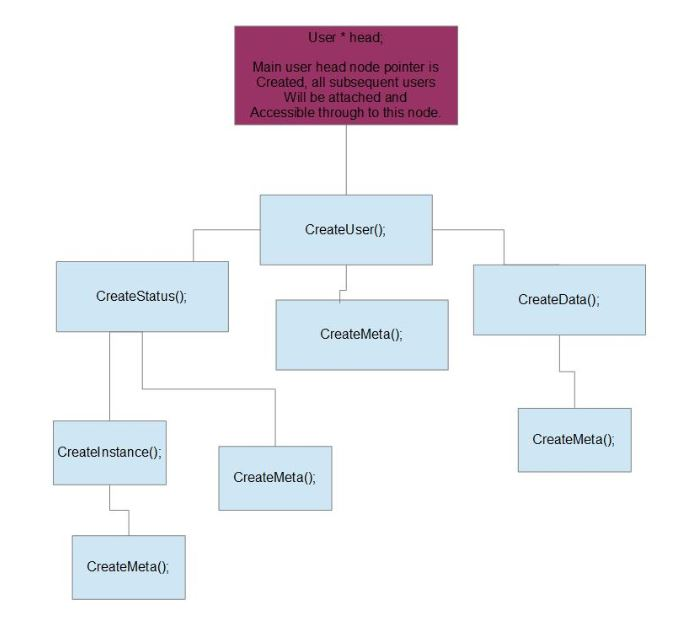
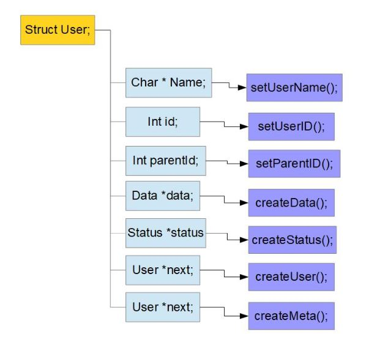

# UserData

This repository contains logic (functions) and elements (structs)	
that can help when needing to deal with user information. 

Instead of producing a binary, it should be compiled into
position-independant code via. a ".so" file for use with
any number of programs via. dynamic linking.

After enough enough time has been dedicated to debug I will
include proper instructions for compile, possibly make/install.
Any help with efficency in this regard would be appreciated.

### How to use this library.

This user data library can be used to handle users, their
status and specific instances of thir status through linked
lists of linked lists.

Although the library is called user data, there is no reason
that it has to be a user specifically and can technically be
used to track the status of any data.

This library specifically provides the predefined data
structures and functions that provide the above described
functionality. As a dev who chooses to use this library
you only need to create your starting point ( _which should
be migrated to an initialize routine and hanled in a way 
that is more invisible to the user._ 

After which creating users, status and instances of those
status's is done though calling the predifed functions and
passing the data to them.

*This piece of software is only in it's infancy and still
 needs considerable testing to determine best course-of-action.*

### Here is an example of how functions are called to create a "user":

### Which internally looks like the this:

### going a level deeper:
*Note: at this level it's more for development of this libray
then anything the user/dev using this library would have
and interest in.*

 
*Note: In the visualization folder there are more images
that show visually how data is handled and which routines
are called to create said data.*

It is still recommeded that you look at userProfile.h
and understand the data structures themselves as they
are in the source file. 

## Things I would like to add to this software:

## // TODO:

	0.
	   Update THIS readme to detail how this library
	   is supposed to be used. As of now this readme
	   is more about waht needs to be done.
	
		The TODO elements in this file  should
		be moved to the todo.txt file; Saving
		this file for usage information that
		includes the visualizations in the
		visualizations file to help describe
		the usages.	

	   See the above *how to use this library.*

	1.
	   Need functions to free all the pointers in
	   all the nodes that have memory allocated to
	   them internally in the linked lists.

	   Create function to find specific nodes and or
	   walk through the lists.

	2.
	   Disk I/O functions to save the data between program
	   runs. This should eventually implement atomicity.

	3.
	   Add memory alignment and other efficencies to 
	   wrapper function(s) in format.c source file.
	   
	4.
	   Add openssl library for creating hashes in the nodes
	   and for use in the validation functions.

	5.
	   Finish function definitions in userInteraction
	   module. Then define their proper usage in
	   docmentation. 

	6.
	   Important, create linked list modification wrappers.
		eg. swap prev, swap ahead.
	   --- There is a high level of code duplication.

	   --  Also adding a pointer to the previous node for
	       backward searching (doubly linked list) in
	       each node may increase search efficency.

	7.
	   Check that all source file are added correctly.

	8.
	   Build / Make scripts.

	9.
	  Testing.

## As of now:
###   This is a work in progress and is currently not ready for use.

